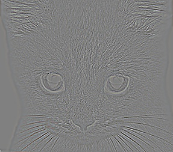

# 張植鈞 <span style="color:red">(student ID: 102061214)</span>

# Project 1 / Image Filtering and Hybrid Images

## Overview
The goal of this project is to implement image filtering by ourselves instead of unsing the Matlab build-in function "conv2" or "filter", etc. Thus, I tried to follow the definition of 2D-convolution and its formula to complete my function. After finishing it, we have to use our function to create hybrid images. Hybrid images are combined by two images. One only has high frequency components, and the other only has low frequency components. By doing so, the images change in interpretation as a function of the viewing distance. Thus, we need to use our function to filter images.

## Implementation
1. Create My Own Function(my_imfilter.m)
Steps:
	* 1. Replicated Boundary Pixels: 
	
	We have to keep the resolution of images but convolution will reduce it. There are many solutions to deal with this issue and the method I use is to replicate the boundary pixels of input images instead of padding zeros. The reason is that padding zeros may increase high frequency components in the images, and this might cause problems.
	
	
	
	* 2. Flip the Mask:
	
	According to the formula below, we have to flip the mask(filter) first before doing 2D convolution.

	* 3. Weighted and Sum:
	
	The last step, to compute the output, is to slide the mask pixels by pixels, weighted, and sum all. Repeatly do this until the end, and then we can get the output.
	```
	for d = 1:dim
    	for i = 1:img_h
        	for j = 1:img_w
            	tmp = pad_img(f_h+i-1-y:f_h+i-1+y, f_w+j-1-x:f_w+j-1+x, d) .* filter;
            	output(i, j, d) = sum(tmp(:));
        	end
    	end
	end
	```

	

2. Create Hybrid Images
Steps:
	* 1. Get Low-Frequency Dominated Picture: 
	I use low pass filter(Gaussian filter) to filter the high frequency components so I can get low-frequency dominated picture.
	```
	filter = fspecial('Gaussian', cutoff_frequency*4+1, cutoff_frequency);
	low_frequencies = my_imfilter(image1, filter);
	```
	* 2. Get High-Frequency Dominated Picture: 
	First, I use low pass filter(Gaussian filter) to filter the high frequency components so I can get low-frequency dominated picture. Next, I subtract the low-frequency dominated picture from the origin picture so I get the high-frequency dominated picture. This way is easier than using high pass filter.
	```
	high_frequencies = image2 - my_imfilter(image2, filter);
	```
	* 3. Merge the Above Two Pictures to Get Hybrid Image:
	```
	hybrid_image = low_frequencies + high_frequencies;
	```
	* 4. Scale the Image: 
	Downsample the hybrid image into different sizes so as to create the feeling of looking a picture from a long distance.

## Installation
* How to compile from source?

Compile my_imfilter.m and proj1.m in Matlab

Usage: output = my_imfilter(image, filter)

### Results

<table border=1>
<tr>
<td>




</td>
</tr>

<tr>
<td>


</td>
</tr>

</table>


